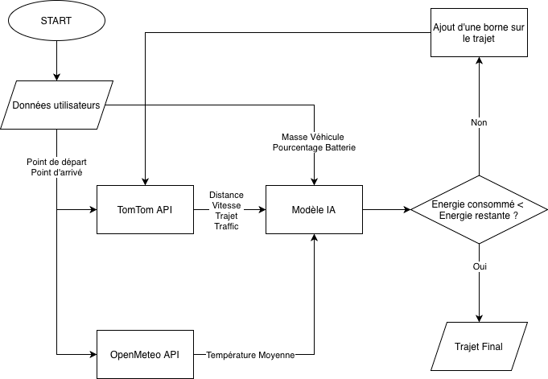

# Phase 2 — Recherche du dataset et création du code

Ce document rassemble la deuxième phase du projet : recherche du dataset, analyse de celui-ci, détermination des features, création du code avec choix du type de machine learning et création du code principal avec ajout des API. Il sert de base à la création du code final et à l'interface utilisateur.

---

## 1. Recherche du dataset

Comme mentionné dans la partie 1, nous avons utilisé le site Kaggle pour trouver notre base de données. Nos critères principaux étaient bien sûr l'énergie consommée car il s'agit de notre objectif mais nous voulions aussi en priorité : la distance parcourue, la vitesse moyenne et le pourcentage de batterie au départ. 

Nous avons réussi à trouver une base de données très complète avec : la vitesse en km/h, l’accélération en m/s², l’état de la batterie en %, la tension de la batterie en V, la température de la batterie en °C, le mode de conduite, le type de route, les conditions de circulation, la pente en %, les conditions météorologiques, la température en °C, l’humidité en %, la vitesse du vent en m/s, la pression des pneus en psi, la masse du véhicule en kg, la distance parcourue en km et la consommation d’énergie en kWh.

## 2. Nettoyage du dataset et création du modèle de machine learning

Nous avons ensuite étudié quelles features seraient possibles à récupérer à partir uniquement des données véhicule et d'APIs avec le lieu de départ et le lieu d'arrivée, ce qui a donné lieu à 7 features principales retenues : la vitesse en km/h, l’état de la batterie en %, le mode de conduite, le type de route, les conditions de circulation, la pente moyenne, la température en °C, la masse du véhicule en kg et la distance parcourue en km.

Nous avons pu à partir de cela créer un logigramme :

Nous avons converti ce logigramme en code dans le fichier **data.py**.

## 3. Création du code principal

Pour ce code nous avons choisi les APIs que nous allions devoir utiliser. Après réflexion, nous avons sélectionné :

- **Routing API de TomTom :** Récupère le chemin (géométrie) entre deux points à partir des coordonnées lat/long.
- **Geocoding API de TomTom :** Récupère les coordonnées lat/long à partir d'une adresse textuelle.
- **OpenMeteo :** Récupère la température et le vent d'un endroit en temps réel à partir des coordonnées lat/long.
- **OpenMeteo Elevation :** Récupère l'altitude précise d'un point pour calculer le dénivelé.
- **Mapbox Static Images API :** Génère une image de carte statique (PNG) avec le tracé de l'itinéraire.
- **API Plaque Immatriculation :** Service permettant d'obtenir les caractéristiques techniques (poids, modèle) à partir de l'immatriculation.

L'architecture du code (`Main.py`) fonctionne de manière séquentielle :
1.  **Géocodage** des adresses.
2.  **Calcul de l'itinéraire** et récupération des points GPS.
3.  **Segmentation :** Découpage du trajet en tronçons de 5 km pour affiner la précision.
4.  **Enrichissement :** Appel des APIs Météo et Altitude pour chaque segment.
5.  **Prédiction :** Appel du modèle IA pour estimer la consommation segment par segment.

## 4. Entraînement et Optimisation du Modèle (Train_Model.py)

Cette étape a constitué le cœur technique du projet. Nous avons choisi l'algorithme **XGBoost** pour sa performance sur les données tabulaires.

### 4.1. Difficultés rencontrées
* **Nettoyage :** Le dataset présentait des irrégularités (absence d'en-tête, valeurs nulles). Un script de chargement adaptatif a été créé.
* **Performance initiale :** Le modèle utilisant les données brutes plafonnait à un score de précision $R^2$ de **0.88**. Il manquait de finesse pour interpréter les pics de consommation.

### 4.2. Solution : "Physics-Informed Machine Learning"
Pour dépasser ce plafond, nous avons injecté des lois physiques directement dans l'entraînement en créant de nouvelles variables (Feature Engineering) :
1.  **Puissance Aérodynamique ($V^3$) :** Pour modéliser la résistance de l'air qui augmente exponentiellement.
2.  **Puissance Inertielle ($M \cdot a \cdot v$) :** Pour capturer l'effort d'accélération.
3.  **Puissance Gravitationnelle ($M \cdot g \cdot v$) :** Pour modéliser l'impact des côtes.
4.  **Thermique ($HVAC$) :** Écart à 21°C pour estimer le chauffage/climatisation.

### 4.3. Validation
Grâce à ces ajouts et une validation croisée (Cross-Validation 5-Fold), nous avons atteint un score de précision final de **0.9300**.

## 5. Calibration et Résultats Finaux

Une fois le modèle intégré, nous avons effectué un test sur le trajet **Rennes → Laval (74 km)**.

* **Problème d'échelle :** Le dataset d'origine concernait des véhicules très lourds ou à forte consommation, donnant une prédiction initiale irréaliste (126 kWh).
* **Calibration :** Nous avons appliqué un facteur correctif ($k=0.12$) pour adapter l'IA à un véhicule de tourisme standard (~1800 kg).
* **Résultat Final :** Le système prédit désormais **14.10 kWh** pour 74 km (soit ~19 kWh/100km), ce qui est parfaitement cohérent avec la réalité.

## 6. Conclusion de la Phase 2

Nous disposons désormais d'un **back-end fonctionnel et robuste**. Le code est capable de calculer un itinéraire, d'interroger des conditions réelles et de fournir une estimation énergétique précise basée sur la physique.

La prochaine étape (Phase 3) consistera à créer l'interface utilisateur pour rendre cet outil accessible.